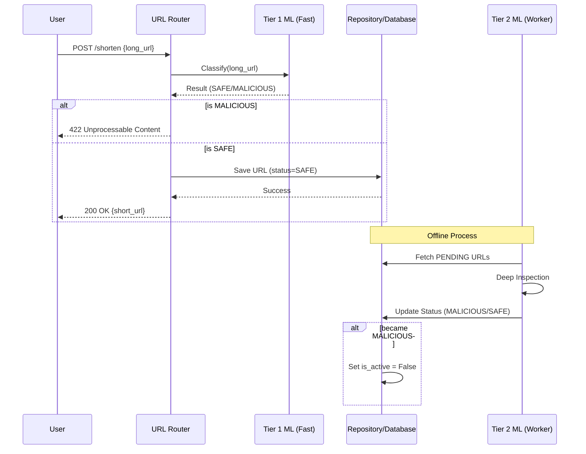

# Architecture Overview

This document describes the high-level architecture of the URL Shortener and how the Machine Learning components will be integrated.

## 🏗️ Current Component Layout

### 1. API Layer (`app/routers`)
- **`url.py`**: Handles URL shortening (`/shorten`) and redirection (`/{short_url}`).
- **`auth.py`**: Manages user authentication and registration.

### 2. Core Logic (`core/`)
- **`entities/`**: Domain models (e.g., `Url`, `User`).
- **`services/`**: Business logic (e.g., `HashingService`).

### 3. Infrastructure (`infra/`)
- **`db/models/`**: SQLAlchemy models for database persistence.
- **`db/repositories/`**: Data access patterns using the Repository pattern.
- **`services/db_service.py`**: Database connection and session management.

---

## 🤖 ML Integration Strategy

The ML classification will follow a **2-tier approach** to balance latency and accuracy.

### ⚡ Tier 1: Synchronous Classification (Fast)
- **Location**: Triggered within the `url.shorten` endpoint.
- **Flow**:
    1. User submits a long URL.
    2. API calls the **Fast Classifier**.
    3. If `MALICIOUS`, return `400 Bad Request` immediately.
    4. If `SAFE` or `PENDING`, create short code and save to DB.
- **Goal**: Catch obvious phishing attempts and known malicious domains with minimal overhead.

### 🔍 Tier 2: Asynchronous Classification (Deep)
- **Location**: Background worker process.
- **Flow**:
    1. A background task periodically queries the DB for URLs with `safety_status = PENDING` or recent scans.
    2. API calls a **Heavyweight Model** (e.g., BERT-based) or external security APIs.
    3. Update `safety_status` and `threat_score` in the DB.
    4. If now classified as `MALICIOUS`, set `is_active = False`.
- **Goal**: Perform deep inspection of the URL structure, content, and reputation without delaying the user response.

---

## 🔄 Data Flow for Shortening

