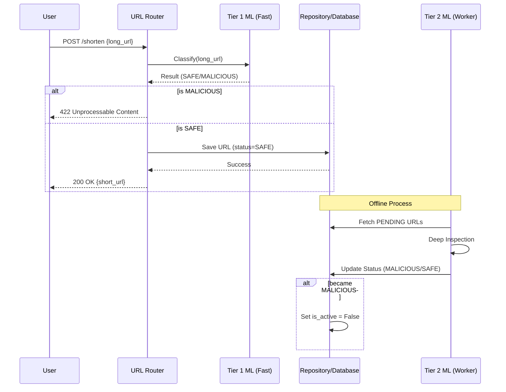

# Architecture Overview

This document describes the high-level architecture of the URL Shortener and how the Machine Learning components are integrated.

## 🏗️ Component Layout

### 1. API Layer (`app/`)
- **`api.py`**: Application entry point with lifespan management (Redis, DB initialization).
- **`routers/url.py`**: URL shortening (`PUT /shorten`) and redirection (`GET /{short_url}`).
- **`routers/auth.py`**: User registration (`POST /register`) and login (`POST /login`).
- **`dependencies/`**: FastAPI dependency injection for sessions, repositories, and services.
- **`schemas/`**: Pydantic request/response models.

### 2. Core Logic (`core/`)
- **`entities/`**: Domain models (`Url`, `User`, `ClassifierResult`, `ClassificationResult`).
- **`repositories/`**: Abstract repository interfaces using Python `Protocol` classes.
- **`services/`**: Business logic (`HashingService`, `UrlValidator`).
- **`services/classification/`**: ML-powered URL classification system.
  - **`classifier/base.py`**: `BaseUrlClassifier` protocol defining the classifier interface.
  - **`classifier/online_classifier.py`**: Tier 1 XGBoost classifier (19 features).
  - **`classifier/bert_classifier.py`**: Tier 2 BERT transformer classifier.
  - **`classifier/onnx_classifier.py`**: Generic ONNX model wrapper.
- **`enums/`**: Domain enums (`SafetyStatus`: PENDING, SAFE, MALICIOUS, SUSPICIOUS).

### 3. Infrastructure (`infra/`)
- **`db/models/`**: SQLAlchemy ORM models (`UserModel`, `UrlModel`, `ClassificationResultModel`).
- **`db/repositories/`**: PostgreSQL repository implementations.
- **`services/db_service.py`**: Async database session management.
- **`config.py`**: Pydantic settings (`BaseConfig` shared, `AppConfig` for FastAPI).

### 4. Workers (`workers/`)
- **`celery_app.py`**: Celery configuration, task routing, and beat schedule.
- **`tasks/classification.py`**: `classify_pending_batch` task for BERT classification.
- **`config.py`**: Worker-specific configuration (`WorkerConfig` extends `BaseConfig`).
- **`db.py`**: Synchronous database session management for workers.

---

## 📊 Database Schema

### Models & Relationships

| Model | Table | Primary Key | Description |
|-------|-------|-------------|-------------|
| `UserModel` | `users` | `user_id` | User accounts with email/password |
| `UserPermissionModel` | `user_permissions` | `(user_id, permission)` | User permission assignments |
| `UrlModel` | `urls` | `short_code` | Shortened URLs with safety status |
| `ClassificationResultModel` | `classification_results` | `id` | Classification audit log |

### Entity Relationships
```
erDiagram
    USERS ||--o{ USER_PERMISSIONS : has

    USERS ||--o{ URLS : owns
    USERS {
        int id
    }
    URLS {
        int owner_id
        string url_short_code
    }

    URLS ||--o{ CLASSIFICATION_RESULTS : produces
    CLASSIFICATION_RESULTS {
        string url_short_code
    }

```

### Key Fields on `urls`
- `safety_status`: PENDING | SAFE | MALICIOUS | SUSPICIOUS
- `threat_score`: Classifier confidence (0.0 - 1.0)
- `classifier`: Name of the model that made the determination
- `classified_at`: Timestamp of last classification

---

## 🌐 API Endpoints

| Method | Path | Auth | Description |
|--------|------|------|-------------|
| GET | `/` | No | Root endpoint with API info |
| GET | `/health` | No | Health check |
| POST | `/api/v1/auth/register` | No | Create user account |
| POST | `/api/v1/auth/login` | No | Get JWT access token |
| PUT | `/api/v1/url/shorten` | Yes | Create shortened URL |
| GET | `/api/v1/url/{short_url}` | No | Redirect to original URL (302) |

All endpoints are rate-limited via Redis-backed FastAPILimiter.

---

## 🤖 ML Integration Strategy

The ML classification will follow a **2-tier approach** to balance latency and accuracy.

### ⚡ Tier 1: Synchronous Classification (Fast)
- **Location**: Triggered within the `url.shorten` endpoint.
- **Implementation**: `OnlineClassifier` using XGBoost model with ONNX runtime.
- **Flow**:
    1. User submits a long URL.
    2. API calls the **Fast Classifier** (`OnlineClassifier`).
    3. If `MALICIOUS`, return `422 Unprocessable Entity` immediately.
    4. If `SAFE` or `SUSPICIOUS`, create short code and save to DB with classification results.
- **Features**:
    - XGBoost model inference via ONNX (< 50ms latency).
    - Pattern-based detection for known malicious indicators.
    - Threat score calculation (0.0 to 1.0).
    - Database persistence of classification results.
- **Goal**: Catch obvious phishing attempts and known malicious domains with minimal overhead.

### 🔍 Tier 2: Asynchronous Classification (Offline)
- **Location**: Celery worker process (`workers/tasks/classification.py`).
- **Implementation**: `BertUrlClassifier` using URL-BERT model with ONNX runtime.
- **Flow**:
    1. Celery beat schedules `classify_pending_batch` task hourly.
    2. Worker fetches URLs with `safety_status = PENDING` from the database.
    3. Each URL is classified using the BERT-based classifier.
    4. Classification results are stored with threat scores and timestamps.
    5. If classified as `MALICIOUS`, the URL is automatically disabled (`is_active = False`).
- **Monitoring**: Flower dashboard available at port 5555 for task monitoring.
- **Goal**: Perform deep inspection of the URL structure, content, and reputation without delaying the user response.

---

## 🔄 Data Flow for Shortening


---

## 🐳 Docker Services

The project includes a complete Docker Compose setup for local development:

| Service | Container | Port | Description |
|---------|-----------|------|-------------|
| `postgres` | PostgreSQL 16 | 5432 | Primary database |
| `redis` | Redis 7 | 6379 | Rate limiting & Celery broker |
| `app` | FastAPI | 8000 | Main API server |
| `celery-worker` | Celery | - | Classification task processor |
| `celery-beat` | Celery Beat | - | Periodic task scheduler |
| `flower` | Flower | 5555 | Celery monitoring dashboard |

---

## 🔧 Configuration

### Environment Variables

| Variable | Required | Description |
|----------|----------|-------------|
| `DATABASE_URL` | Yes | PostgreSQL async connection string |
| `REDIS_URL` | Yes | Redis connection string |
| `SECRET_KEY` | Yes | JWT signing key (min 32 chars) |
| `DEBUG` | No | Enable debug mode (default: false) |

### ML Model Paths

| Model | Default Path |
|-------|--------------|
| Online XGBoost | `assets/models/online_classifier_xgb_v1.0.0.onnx` |
| Offline BERT | `assets/models/urlbert_classifier_v4/urlbert_classifier_v4.onnx` |
| BERT Tokenizer | `assets/models/urlbert_classifier_v4/`|

---

## 🧪 Testing

- **Framework**: pytest with pytest-asyncio
- **Database**: SQLite in-memory via aiosqlite (not PostgreSQL)
- **Structure**: Tests mirror the source structure (`tests/core/`, `tests/infra/`, `tests/workers/`)
