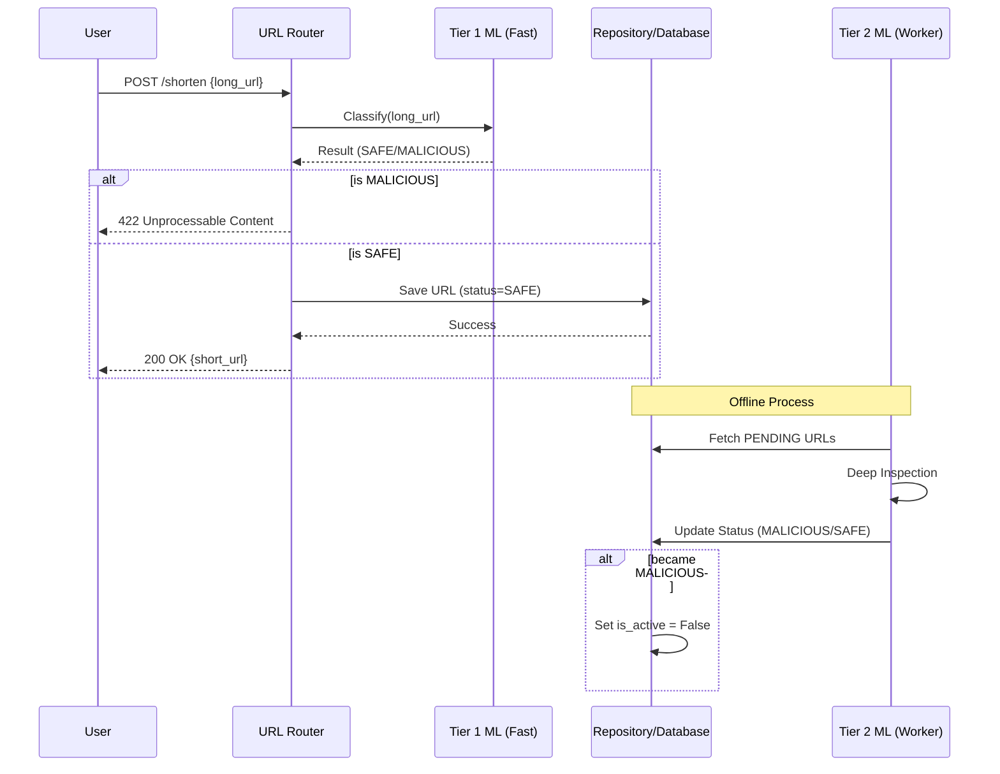

# Architecture Overview

This document describes the high-level architecture of the URL Shortener and how the Machine Learning components will be integrated.

## 🏗️ Current Component Layout

### 1. API Layer (`app/routers`)
- **`url.py`**: Handles URL shortening (`/shorten`) and redirection (`/{short_url}`).
- **`auth.py`**: Manages user authentication and registration.

### 2. Core Logic (`core/`)
- **`entities/`**: Domain models (e.g., `Url`, `User`, `ClassificationResult`).
- **`services/`**: Business logic (e.g., `HashingService`, `UrlValidationService`).
- **`services/classification/`**: ML-powered URL classification system.
  - **`classifier/`**: Classifier implementations (`OnlineClassifier`, `ONNXClassifier`).
  - Feature extraction and model inference logic.

### 3. Infrastructure (`infra/`)
- **`db/models/`**: SQLAlchemy models for database persistence.
- **`db/repositories/`**: Data access patterns using the Repository pattern.
- **`services/db_service.py`**: Database connection and session management.
- **`config.py`**: Configuration classes (`BaseConfig`, `AppConfig`) using pydantic-settings.

### 4. Workers (`workers/`)
- **`celery_app.py`**: Celery application configuration and beat schedule.
- **`tasks/classification.py`**: Batch URL classification task using BERT classifier.
- **`config.py`**: Worker-specific configuration (`WorkerConfig` extends `BaseConfig`).
- **`db.py`**: Database session management for workers.

---

## 🤖 ML Integration Strategy

The ML classification will follow a **2-tier approach** to balance latency and accuracy.

### ⚡ Tier 1: Synchronous Classification (Fast)
- **Location**: Triggered within the `url.shorten` endpoint.
- **Implementation**: `OnlineClassifier` using XGBoost model with ONNX runtime.
- **Flow**:
    1. User submits a long URL.
    2. API calls the **Fast Classifier** (`OnlineClassifier`).
    3. If `MALICIOUS`, return `422 Unprocessable Entity` immediately.
    4. If `SAFE` or `SUSPICIOUS`, create short code and save to DB with classification results.
- **Features**:
    - XGBoost model inference via ONNX (< 50ms latency).
    - Pattern-based detection for known malicious indicators.
    - Threat score calculation (0.0 to 1.0).
    - Database persistence of classification results.
- **Goal**: Catch obvious phishing attempts and known malicious domains with minimal overhead.

### 🔍 Tier 2: Asynchronous Classification (Offline)
- **Location**: Celery worker process (`workers/tasks/classification.py`).
- **Implementation**: `BertUrlClassifier` using URL-BERT model with ONNX runtime.
- **Flow**:
    1. Celery beat schedules `classify_pending_batch` task hourly.
    2. Worker fetches URLs with `safety_status = PENDING` from the database.
    3. Each URL is classified using the BERT-based classifier.
    4. Classification results are stored with threat scores and timestamps.
    5. If classified as `MALICIOUS`, the URL is automatically disabled (`is_active = False`).
- **Monitoring**: Flower dashboard available at port 5555 for task monitoring.
- **Goal**: Perform deep inspection of the URL structure, content, and reputation without delaying the user response.

---

## 🔄 Data Flow for Shortening

